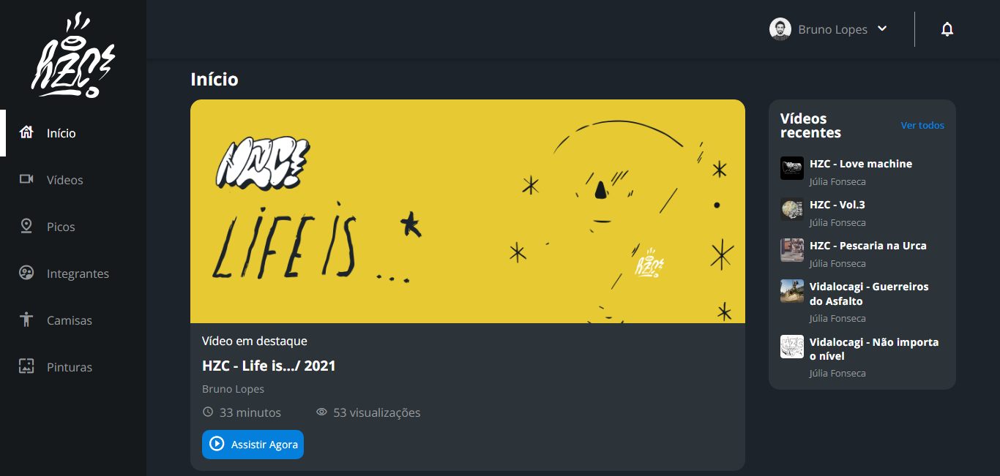

<h1 align="center"> HZC </h1>

HZC é um site voltado ao publico da cultura do skate onde podem assistir a vídeos de manobras, ouvir músicas, comprar camisetas e verificar os melhores picos de skate 

  <a href="#-tecnologias">Tecnologias</a>&nbsp;&nbsp;&nbsp;|&nbsp;&nbsp;&nbsp;
  <a href="#-projeto">Projeto</a>&nbsp;&nbsp;&nbsp;|&nbsp;&nbsp;&nbsp;
  <a href="#-layout">Layout</a>

 

  

## 🚀 Tecnologias

Esse projeto foi desenvolvido com as seguintes tecnologias:

- HTML e CSS
- JavaScript
- Figma

## 💻 Projeto

HZC foi um projeto criado durante um curso para estudar disposição CSS com flexbox e grid.

## 🦾 Novas habilidades adquiridas com o projeto

- Utilização do EMMET
- Flexbox e suas propriedades
- Como mostrar e esconder um menu lateral com JavaScript
- Grid e suas propriedades

[Visite o projeto online](https://alura-skate-spots.vercel.app/)

## 🔖 Layout

Para acessar o layout do figma [clique aqui](https://www.figma.com/file/ibWktwVpnog76rMYOdVhks/Dispondo-elementos-com-flexbox-e-grid?type=design&mode=design&t=d71nXM6EqvkltfkG-0)